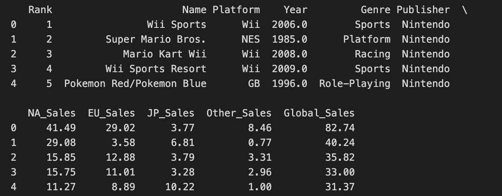
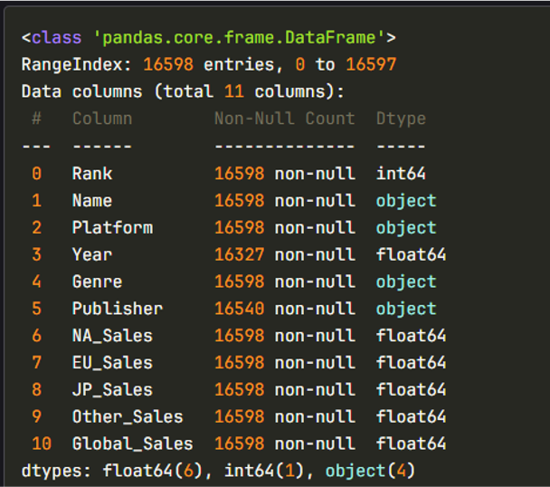
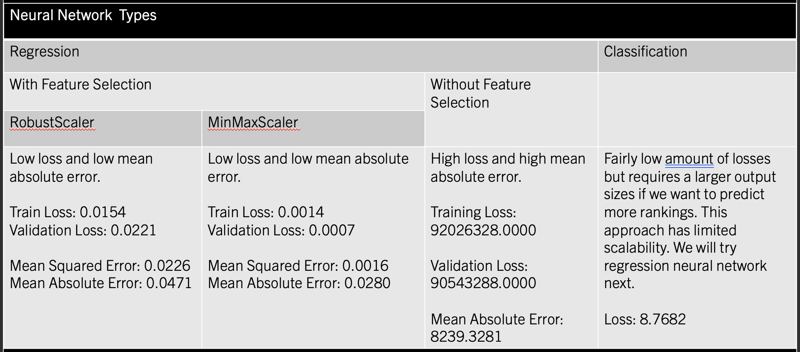
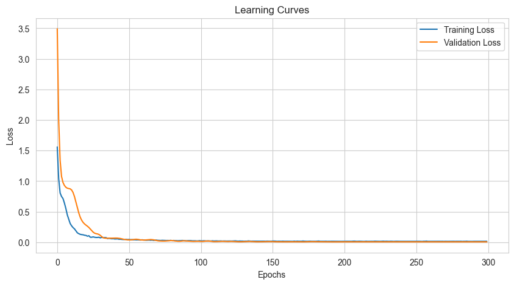
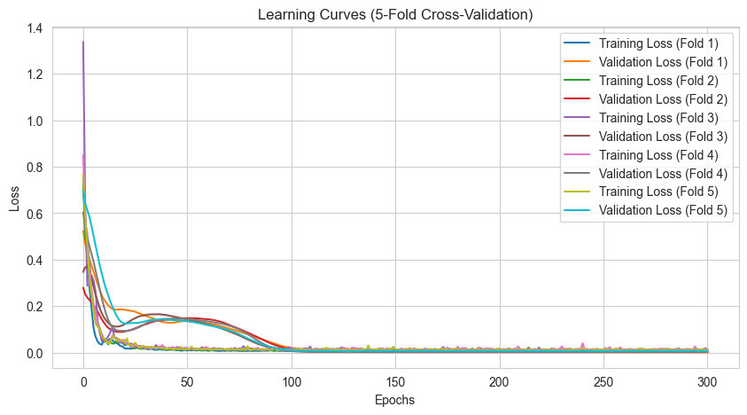
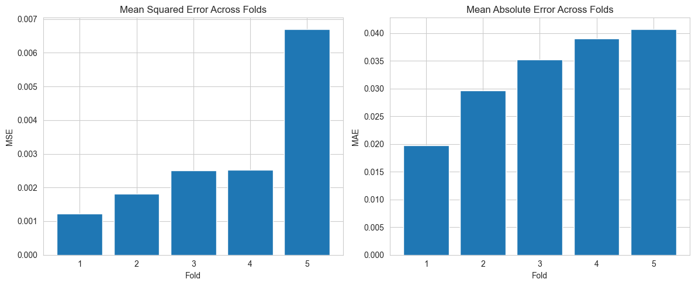
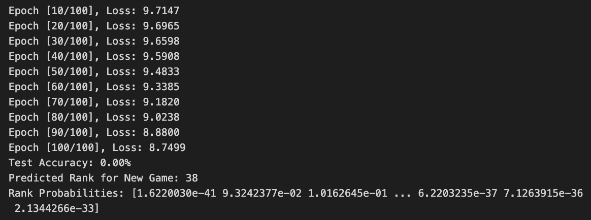
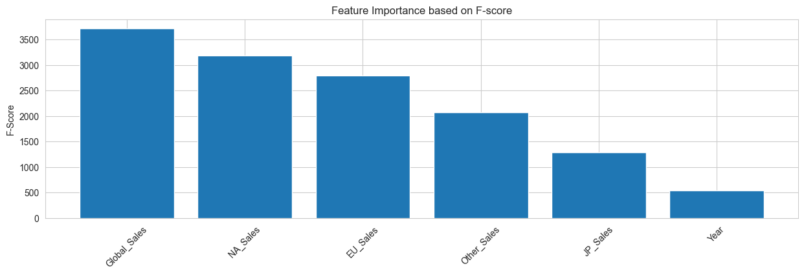

# Video Games Sales Analysis

> Vy Nguyen & Huy Vuong

## Data Exploration

This dataset contains a list of 16,500 video games with sales greater than 100,000 copies.

### Fields

-   Rank - Ranking of overall sales
-   Name - The games name
-   Platform - Platform of the games release (i.e. PC,PS4, etc.)
-   Year - Year of the game's release
-   Genre - Genre of the game
-   Publisher - Publisher of the game
-   NA_Sales - Sales in North America (in millions)
-   EU_Sales - Sales in Europe (in millions)
-   JP_Sales - Sales in Japan (in millions)
-   Other_Sales - Sales in the rest of the world (in millions)
-   Global_Sales - Total worldwide sales.

### Dataset Peaking

### Data types

## Methodology

To analyze and gain insights from the Video Game Sales dataset, we employed a structured approach combining statistical modeling, machine learning, and clustering techniques. The following methodologies were applied:

1. **Data Exploration**:  
   We started by exploring the dataset to understand its structure, distribution, and key patterns. This included:
    - Visualizing sales trends across different regions (NA, EU, JP, and Other).
    - Identifying correlations between variables such as sales, genre, platform, and year of release.
    - Addressing data quality issues such as missing values and skewed distributions through transformations (e.g., log and Box-Cox).
2. **Linear Regression**:  
   To predict global sales based on regional sales and other features, we implemented a Linear Regression model. This model allowed us to:
    - Assess the relationships between sales metrics across regions.
    - Provide a baseline prediction model for comparison with more complex techniques.
3. **Neural Network**:  
   A neural network model was developed to enhance prediction accuracy. Leveraging its capability to capture non-linear relationships, the model used features such as genre, platform, publisher, and regional sales to predict global sales.

    ### Neuro Network Models comparison: 

4. **Clustering**:  
   To group similar games based on their sales performance and characteristics, we applied two clustering algorithms:
    - **K-Means Clustering**: Identified distinct clusters of games by sales metrics and other features, providing insights into game categories based on performance.
    - **Hierarchical Clustering**: Used to build a dendrogram, revealing hierarchical relationships between games and identifying clusters based on sales patterns. By combining these methodologies, we gained a comprehensive understanding of the dataset and derived actionable insights into the factors influencing video game sales.

## Finding:

Through our analysis of the Video Game Sales dataset, we derived the following key findings:

1. **Linear Regression (5-Fold Cross-Validation):**
    - **Average Mean Squared Error (MSE):** \(4.27 \times 10^{19}\)
    - **Average Mean Absolute Error (MAE):** 100,816,179.71
    - **Average R² Score:** \(-2.79 \times 10^{20}\)  
      These results indicate that the linear regression model struggled to predict global sales effectively, likely due to high variability and non-linear relationships within the dataset.
2. **Hierarchical Clustering:**

    - The dendrogram analysis suggested that the dataset could be optimally divided into **2 clusters**.
    - However, the silhouette score analysis indicated that **5 clusters** provided better-defined groupings.  
      This discrepancy highlights the complexity of the dataset and suggests further exploration of clustering techniques or domain-specific adjustments to refine the cluster definitions.

3. **KMeans Clustering:**

    - Shows poor results due to the even distribution of the data.

    

4. **Neural Network Model:**

    - Regression Neural Network with Feature Selection with MinMaxScaler or RobustScaler models have good learning curves and low mean-square error and mean-absolute error.

      

    - Classification Neural Network: we used Softmax activation function for the output layer and probability distributions. However, the losses are still not yet converged to zero. 

5. **Feature Importance:**

    
